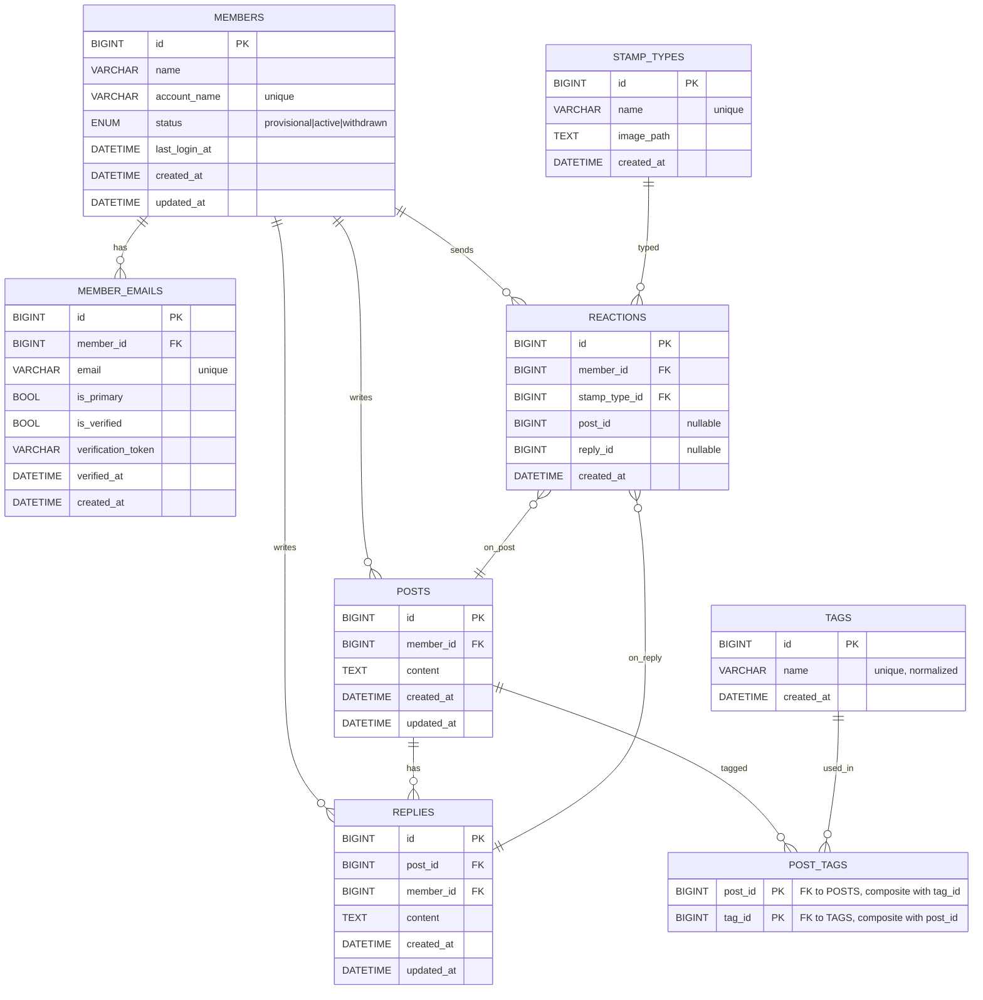

```mermaid
%% C&P Question 2 ER (Mermaid ER)
erDiagram
    MEMBERS ||--o{ MEMBER_EMAILS : has
    MEMBERS ||--o{ POSTS         : writes
    MEMBERS ||--o{ REPLIES       : writes
    MEMBERS ||--o{ REACTIONS     : sends

    POSTS   ||--o{ REPLIES       : has
    POSTS   ||--o{ POST_TAGS     : tagged
    TAGS    ||--o{ POST_TAGS     : used_in
    STAMP_TYPES ||--o{ REACTIONS  : typed

    REACTIONS }o--|| POSTS        : on_post
    REACTIONS }o--|| REPLIES      : on_reply

    MEMBERS {
      BIGINT  id PK
      VARCHAR name
      VARCHAR account_name  "unique"
      ENUM    status        "provisional|active|withdrawn"
      DATETIME last_login_at
      DATETIME created_at
      DATETIME updated_at
    }

    MEMBER_EMAILS {
      BIGINT  id PK
      BIGINT  member_id FK
      VARCHAR email      "unique"
      BOOL    is_primary
      BOOL    is_verified
      VARCHAR verification_token
      DATETIME verified_at
      DATETIME created_at
    }

    POSTS {
      BIGINT  id PK
      BIGINT  member_id FK
      TEXT    content
      DATETIME created_at
      DATETIME updated_at
    }

    REPLIES {
      BIGINT  id PK
      BIGINT  post_id   FK
      BIGINT  member_id FK
      TEXT    content
      DATETIME created_at
      DATETIME updated_at
    }

    TAGS {
      BIGINT  id PK
      VARCHAR name  "unique, normalized"
      DATETIME created_at
    }

    POST_TAGS {
      BIGINT  post_id PK  "FK to POSTS, composite with tag_id"
      BIGINT  tag_id  PK  "FK to TAGS, composite with post_id"
    }

    STAMP_TYPES {
      BIGINT  id PK
      VARCHAR name       "unique"
      TEXT    image_path
      DATETIME created_at
    }

    REACTIONS {
      BIGINT  id PK
      BIGINT  member_id     FK
      BIGINT  stamp_type_id FK
      BIGINT  post_id   "nullable"
      BIGINT  reply_id  "nullable"
      DATETIME created_at
    }
```
